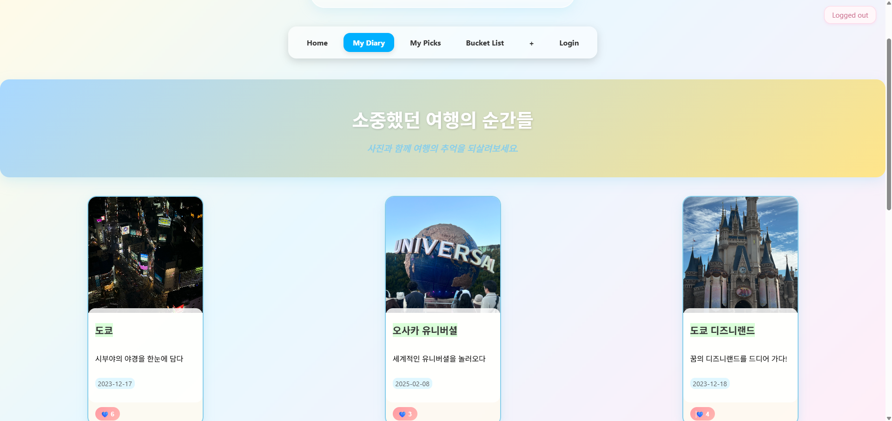
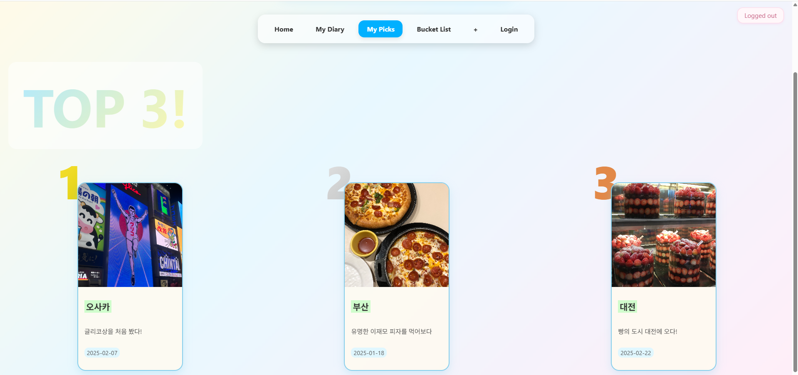
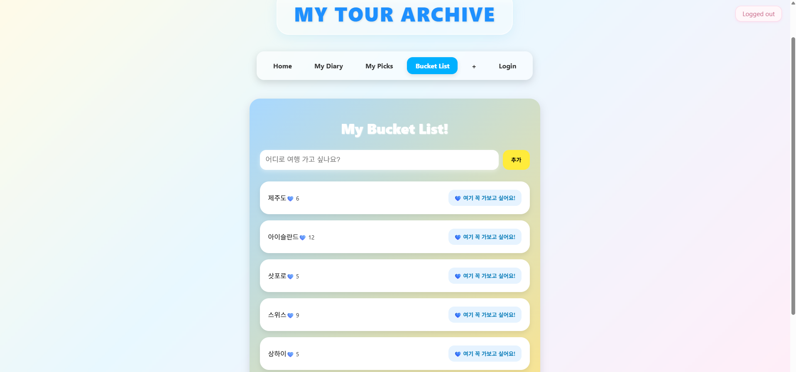
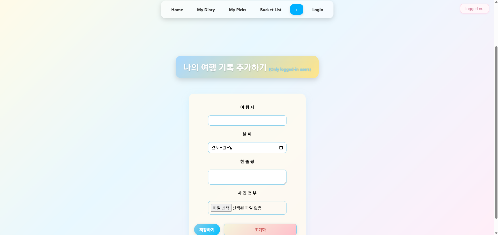
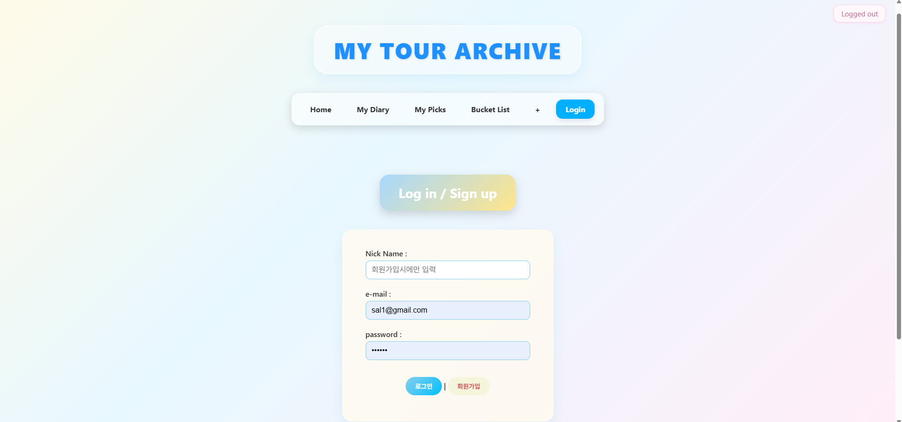

# MyTour

여행 기록 웹 애플리케이션

---

### 학습 방식

- 학교 수업에서 학습한 내용을 기반으로 직접 코드를 작성하며 React 기반 웹 애플리케이션 구조 이해
- 기능 단위로 구조를 나누어 개발
  - 컴포넌트 기반 아키텍처 (Pages - Components - Services) 적용
- Firebase를 활용해 인증, 데이터 저장 및 상태 관리까지 전체 흐름 구현

---

### 학습 출처

학교 수업에서 학습한 내용을 기반으로, 기능을 확장하여 직접 설계 및 구현한 프로젝트입니다.

---

## 여행 기록 웹 서비스

React와 Firebase를 활용하여 구현한 여행 기록 관리 웹 애플리케이션

- 사용자 인증부터 데이터 CRUD, 상태 관리까지 전체 기능을 직접 구현

---

### 주요 기능

- Firebase 로그인 / 회원 인증
- 여행 기록 조회 / 추가 / 수정 / 삭제 (CRUD)
- 좋아요 기능
- 버킷리스트 관리

---

### 사용 기술

- React
- Vite
- Firebase (Authentication, Firestore)

---

### 프로젝트 구조

```id="vite-structure"
src/
 ├── assets
 ├── pages
 ├── components
 ├── services
 ├── hooks
 ├── styles
 ├── App.jsx
 └── main.jsx
```

---

### 실행 화면







